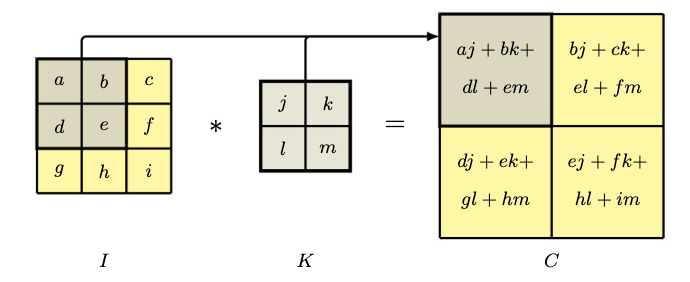
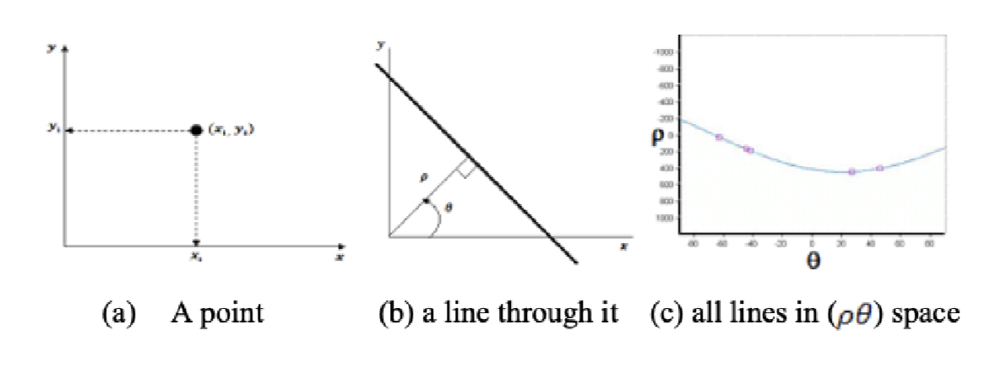
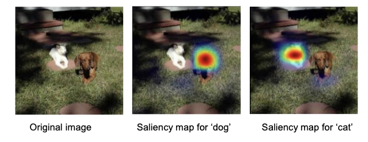

# Mini Tutorial - Computer Vision

Many applications of ML models involve structured data, in which input variables have relationships with each other. One such application is that of image processing, in which pixels are spatialy correlated. A pattern that is found in one part of an image (such an edge or shape) can appear again anywhere else in the image. Traditional ML methods (such as a SVM) do not consider the relation between the elements of an input dataset's vectors $x = (x_1 \dots x_n)$, meaning a feature must be relearned for every location it appears in. As such, there is motivation for an ML architecture geared towards image processing. Convolutional neural networks (CNNs), which this tutorial will mainly focus on, solve this problem by applying filters that "slide" across an image, allowing for fewer learned parameters as well as feature locality.

## Image structure

An image is comprised of a rectangular array of pixels, in which each pixel is assigned a triplet of red, green, and blue channels that are usually represented as 8-bit numbers in the range of $0 \dots 255$. When applying a CNN to an image, it is important to understand four concepts:

*Hierarchy* - There is a natural hierarchical structure in an image when attempting to detect features. For example, an image might have several faces, each of which have eyes, which have irises, which has edges. The idea that smaller features combine into larger ones dictates hierarchy.

*Locality* - In an image, it is more likely for nearby pixels to have a relationship with each other compared to farther pixels. A model would only need to look at a small window of the image in order to detect a feature rather than the entire image itself.

*Equivariance* - Transforming a feature in the image changes the output. For example, changing the location of a feature in the input image changes the output feature map.

*Invariance* - Transforming a feature in the image does not change the output. If an object is of a different scale or rotation, a model should still output the same classification.

## Feature maps

Consider a single unit in the first layer of a CNN that takes in the pixel values from a small patch of the image. We want to learn weight values that detect some low-level feature present in this area. The output of this unit is comprised of a weighted linear combination of the input with the weights, added with a bias and passed through an activation function:

$$z = ReLU(w^T x + w_0)$$

where $x$ is a vector of pixel values from the image.

Since we have one weight per input pixel, we are able to include sparsity into our model (non-sparsity, or polysemanticity, is having one weight represent multiple inputs, which can lead to overfitting).

For an image $I$ with pixel intensities $I(j, k)$ and a filter $K$ with pixel values $K(l, m)$, the feature map $C$ has activation values

$$C(j, k) = \sum_l \sum_m I(j + l, k + m) K(l, m)$$

This of this as a sliding window technique. We are "moving" our filter across the image, with the full multiplication + addition of the elements within the filter and the bounded image being saved into a singular cell in the feature map. The process of convolution is also commonly expressed as $C = I * K$.

## Edge detection

Consider the case of detecting an edge from a grey-scale image. We can think of an edge as there being a significant change in local intensity between pixels.

### Hough Transform

It is possible to detect edges and other shapes of a functional form using the Hough transform. Consider a 2D image tensor as a graph, with points of high intensity being points on the graph. We want to find a line that *directly* passes through as many points as possible. This is different from a regression problem as in regression, the optimum we are solving for is determined by minimizing the loss function (sum of squared residuals), whereas in a Hough transform, we want to maximize the amount of points intersected.

Consider the traditional line equation $y = mx + c$, where $m$ is the slope and $c$ is the y-intercept. Let's create a second space representation in which the dimensions are $m, c$. This will be the *parameter space*, whereas our image is in the *image space*. A point in the image space translates to a line in the parameter space, as it represents all possible combinations $\(m, c\)$ s.t. it passes through that specific point in the image space. When all the points in the image space are translated to the parameter space, the problem then reduces to an optimization problem where we need to find the $\(m, b\)$ which the most lines pass through in the parameter space.

However, the traditional line equation for a Hough transform is usually not used as it is memory intensive ($-\infty < x, y < \infty$). Libraries usually implement the algorithm using polar coordinates in the form $x cos \theta + y sin \theta = \rho$, where $\rho$ is the norm between the origin and the line, and $\theta$ is the angle between $\rho$ and the horizontal $x$-axis.

## Padding

If an image has dimensionality $J * K$ and a convolution is performed with a filter of size $M * M$, we end up with a feature map of size $(J - M + 1) * (K - M + 1)$. Since a reduction in dimensionality might cause the model to lose some information, we can implement *padding* around the border of the original image. Padding with $P$ pixels results in a feature map of dimensionality $(J + 2P - M + 1) * (K - 2P - M + 1)$.

If $P = 0$, then that is called a *valid convolution*.

When the value of P is such that the output feature map is the same size as the input image ($P = \frac{M - 1}{2}$), it is called a *same convolution*.

When padding, the original image is subtracted by its mean, and then padded with zeros. This way, the padding represents the average value of a cell in the image.

## Strides

In practice, filters are usually small compared to the image size ($M << J, K$), meaning the difference in dimensionality between an input image and its feature map is miniscule. In some scenarios, we might want feature maps that are significantly smaller than the input image. To do so, we can use *strided convolutions*, where instead of moving the filter one cell at a time, it is moved in steps of size $S$.

If the same stride is used both horizontally and vertically, the resulting dimensionality will be:

$$\left\lfloor \frac{J + 2P - M}{S} - 1 \right\rfloor * \left\lfloor \frac{K + 2P - M}{S} - 1 \right\rfloor$$

## Multi-dimensional convolutions

So far, we have only covered images that are 2D, meaning they are only grey scale. In order to represent multiple colors, we introduce a third dimension $C$, called the *channel*. An image of size $J * K$ with $C$ channels can be represented as a tensor with dimensionality $J * K * C$. For convolution, we introduce a $M * M * C$ filter, which is comprised of one filter per channel.

To build more flexible models, we can introduce multiple such filters in a convolution layer, allowing each set of filters to detect different features. The filter tensor is now of dimensionality $M * M * C_{in} * C_{out}$, where $C_{out}$ is the number of output channels.

### Pooling

A convolutional layer encodes translational equivariance, meaning the outputs of a feature map are directly related to the pixels in the input image regardless of where the pixels are located (if the pixels are moved, the associated outputs of the feature map move alongside it). However, in cases such as classifying an image, we want the output to be invariant to translations of the input. For example, the relative positions of the eyes, nose, and mouth result in a face and not these individual features in random locations. Small translations in these features should not affect the classification (for example, there being different face shapes) and so we want to be invariant to such changes. This can be solved using *pooling*.

Pooling is similar to convolution in the sense that we have units arranged in a grid format. We can also specify stride and filter size. The difference is that the output of a pooling layer is the result of a simple, fixed function of its inputs, meaning there aren't any learnable weights.

An example of a pooling layer would be *max-pooling*, where each output unit represents the max of all its inputs.

Notice that although this helps in building local translation invariance, pooling can also reduce the dimensionality of an image representation.

As an example of pooling, if we have a feature map with $8$ channels, each of dimensionality $64 * 64$, and we apply max-pooling with a filter of size $2 * 2$ and a stride of 2, the output will be a tensor of dimensionality $32 * 32 * 8$,

## Visualizing CNN outputs

We can visualize the output of a CNN through the use of a *saliency map*, which gives us insight into which regions of an image are most relevant to an object classification. Saliency maps usually take into account the final layer of a CNN, as it still has some level of spatial localization as well as the highest level of semantic representation.

Denote the output classification score before the activation function as $\alpha^{(c)}$ and the pre-activations in the final convolutional layer as $\alpha_{ij}^{(k)}$. We take the average of the derivatives of these two variables:

$$\alpha_k = \frac{1}{M_k} \sum_i \sum_j \frac{\partial \alpha^{(c)}}{\partial \alpha_{ij}^{(k)}}$$

where $i, j$ are the rows and columns of channel $k$, and $M_k$ is the total number of units in that channel.

The partial derivative tells us how much the output classification score will change by if we change this specific pixel at $i, j$ by a small magnitude. Therefore, a high partial derivative represents that this specific pixel is important to the classification.

We then create a weighted sum of the form:

$$L = \sum_k \alpha_k A^{(k)}$$

where $A^{(k)}$ is a matrix with the pre-activation units in channel $k$ in the final convolutional layer.

This resulting array can be superimposed on the original image, creating a "heat map" as shown below.

## Object detection

Consider the case where there are many objects within an image, and we wish to detect the prescence and class of each object. A widely used approach is to use *bounding boxes*, which consists of a rectangle that "bounds" a detected object. The box can be expressed as the coordinates of its centroid along with the width and height in the form of a vector $b = \{b_x, b_y, b_W, b_H\}$. In terms of classification, a fifth feature, the confidence in a class label, is added.

### Evaluation

To evaluate a model's performance on object detection, a commonly implemented method is \{Intersection over Union} (IoU). IoU can be defined as:

$$IoU = \frac{\text{Area of Intersection}}{\text{Area of Union}}$$.

As this is a ratio, it lies in the range between $0$ and $1$, where a value closer to 1 represents a better evaluation. Note that IoU is not used as a loss function as it is hard to optimize using gradient descent, and is only used as an evaluation metric.

### Scalar transformations

Alongside looking for objects in different parts of the image, we can also look for objects at different scales and aspect ratios. For example, a cat sitting upright vs lying down would have different aspect ratios. To solve this, we can simply use a fixed input window with multiple copies of the input image at different scales and aspect ratios. Object detection is then employed for each image, and the bounding box is then transformed back into the original image space.

### Non-Max Supression

It is very common for the bounding boxes of an object to overlap with each other. When assesing the results, you wouldn't see one clean detection but many candidate bounding boxes for the same object. Non-max supression is a technique that aims to eliminate this overlapping boxes. The techinque is as follows:

- Sort all boxes (this is $O(n log n)$, which can be costly if there are lots of boxes).

- Select the box with the highest confidence score and mark it as a correct prediction. Run IoU with that box against all the other boxes.

- If another box has an IoU over the threshold (say >0.5), then remove that box as it has too much overlap.

- Repeat with the remaining boxes until all boxes have been discarded or all boxes have been classified as a successful detection.

## References

Szeliski, R. (2022). Computer vision: Algorithms and applications. Springer. https://www.bishopbook.com

Hassanein, A. S., Mohammad, S., Sameer, M., & Ragab, M. E. (2015). A survey on Hough transform, theory, techniques and applications. arXiv. https://arxiv.org/abs/1502.02160

Lowe, D. G. (1999). Object recognition from local scale-invariant features. Proceedings of the Seventh IEEE International Conference on Computer Vision (ICCV), 1150–1157. https://doi.org/10.1109/ICCV.1999.790410
