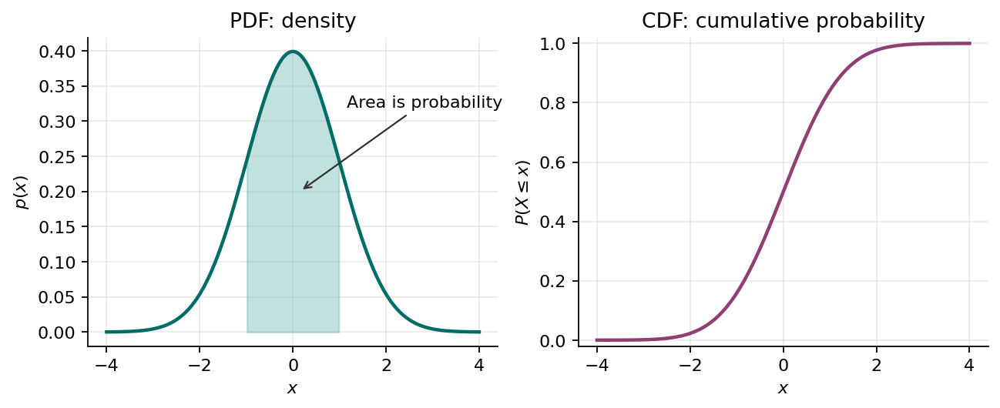
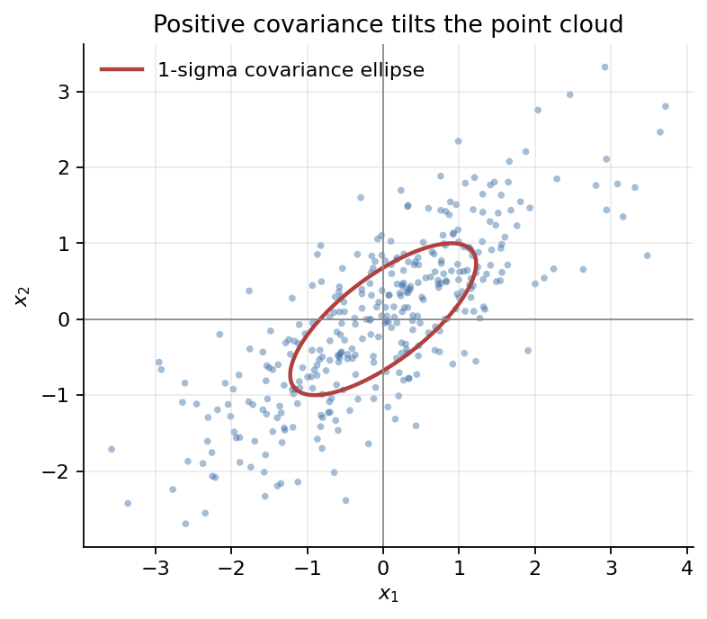
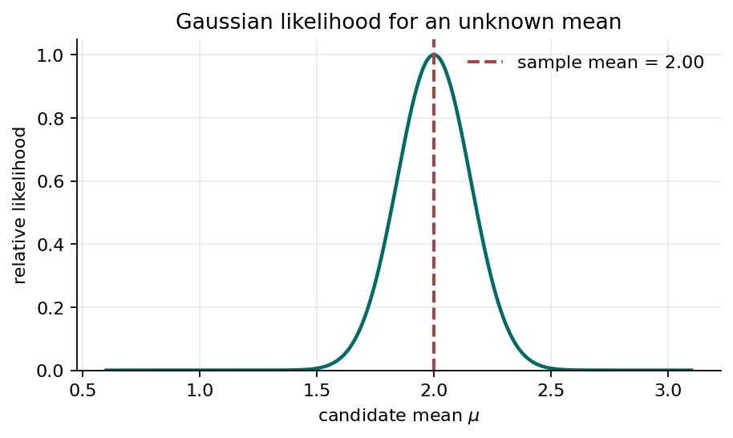
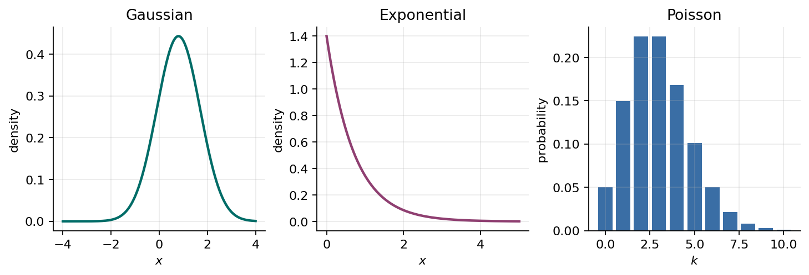

# Mini-Tutorial 1B - Probability Distributions

This tutorial extends Mini-Tutorial 1 from discrete probability to continuous random variables and probability distributions. The central modeling idea is that uncertainty can be represented with probability distributions, learning can be framed as inference from data, and many machine learning models can be built by choosing a distributional form and fitting its parameters.

## Basics of Densities: PDF and CDF

A continuous random variable can take values over an interval, such as altitude error, GPS position error, airspeed, battery voltage, or a neural network score. Unlike a discrete random variable, a continuous random variable does not assign probability mass to individual points. Instead, it uses a **probability density function** or **PDF**.

For a continuous random variable $X$, the density is written:

$$
p(x).
$$

The probability that $X$ falls in an interval is the area under the density:

$$
P(a \leq X \leq b)=\int_a^b p(x)\,dx.
$$

The density must satisfy:

$$
p(x)\geq 0
\qquad \text{and} \qquad
\int_{-\infty}^{\infty}p(x)\,dx=1.
$$

The probability of one exact value is zero:

$$
P(X=x)=0.
$$

This does **not** mean the value cannot occur. It means that probability is assigned to intervals, not individual points. For example, the probability that a UAV's altitude error is exactly $0.1000000000$ meters is zero under a continuous model, but the probability that the error lies between $0.09$ and $0.11$ meters can be positive.

The **cumulative distribution function** or **CDF** is:

$$
F(x)=P(X\leq x)=\int_{-\infty}^{x}p(t)\,dt.
$$

The CDF is useful because probabilities of intervals can be computed by subtraction:

$$
P(a<X\leq b)=F(b)-F(a).
$$

*Fig. 1. A PDF assigns density, and probability is area under the curve. A CDF gives cumulative probability up to a point.*

## Expectations and Covariances

The **expectation** of a continuous random variable is its probability-weighted average:

$$
\mathbb{E}[X]=\int_{-\infty}^{\infty}x\,p(x)\,dx.
$$

For a function $g(X)$:

$$
\mathbb{E}[g(X)]=\int_{-\infty}^{\infty}g(x)p(x)\,dx.
$$

The expectation is the center of mass of the distribution. In machine learning, expected values appear in loss functions, risk minimization, reinforcement learning returns, Bayesian prediction, and uncertainty propagation.

The **variance** measures spread around the mean:

$$
\operatorname{Var}(X)=\mathbb{E}[(X-\mu)^2],
\qquad \mu=\mathbb{E}[X].
$$

Equivalently:

$$
\operatorname{Var}(X)=\mathbb{E}[X^2]-\mathbb{E}[X]^2.
$$

For a random vector $\mathbf{x}\in\mathbb{R}^D$, the expectation is a vector:

$$
\mathbb{E}[\mathbf{x}]=\int \mathbf{x}p(\mathbf{x})\,d\mathbf{x}.
$$

The **covariance matrix** is:

$$
\operatorname{cov}[\mathbf{x}]
=\mathbb{E}\left[(\mathbf{x}-\boldsymbol{\mu})(\mathbf{x}-\boldsymbol{\mu})^\mathsf{T}\right].
$$

The diagonal entries are variances of individual coordinates. The off-diagonal entries are covariances:

$$
\operatorname{cov}[X,Y]=\mathbb{E}[(X-\mathbb{E}[X])(Y-\mathbb{E}[Y])].
$$

Positive covariance means the two quantities tend to move together. Negative covariance means one tends to increase when the other decreases. Near-zero covariance means there is no linear relationship, although nonlinear dependence may still exist.

*Fig. 2. Covariance describes how random variables vary together. For two-dimensional Gaussian data, the covariance matrix controls the orientation and width of the elliptical contours.*

### UAV Example: Position Error

Suppose a UAV estimates its horizontal position error as a random vector:

$$
\mathbf{x}=
\begin{bmatrix}
\text{east error}\\
\text{north error}
\end{bmatrix}.
$$

The mean $\boldsymbol{\mu}$ gives the average bias in the estimate. The covariance matrix describes uncertainty and correlation. If east and north errors have positive covariance, then a large east error often comes with a large north error. A planner can use this covariance to keep a larger safety margin when flying near obstacles.

## Bayesian Probability

In the Bayesian view, probability can represent uncertainty about unknown quantities, not only long-run frequencies. A model parameter can be uncertain and can have a probability distribution.

Let $\boldsymbol{\theta}$ be unknown model parameters and let $\mathcal{D}$ be observed data. Bayes' rule gives:

$$
p(\boldsymbol{\theta}\mid\mathcal{D})
=
\frac{p(\mathcal{D}\mid\boldsymbol{\theta})p(\boldsymbol{\theta})}
{p(\mathcal{D})}.
$$

The terms are:

- $p(\boldsymbol{\theta})$: the **prior**, representing uncertainty before seeing the data.
- $p(\mathcal{D}\mid\boldsymbol{\theta})$: the **likelihood**, describing how probable the data are under each parameter value.
- $p(\mathcal{D})$: the **evidence**, which normalizes the posterior.
- $p(\boldsymbol{\theta}\mid\mathcal{D})$: the **posterior**, representing uncertainty after seeing the data.

For continuous parameters, the evidence is an integral:

$$
p(\mathcal{D})=\int p(\mathcal{D}\mid\boldsymbol{\theta})p(\boldsymbol{\theta})\,d\boldsymbol{\theta}.
$$

This is the core Bayesian workflow:

1. Start with a prior distribution.
2. Use the likelihood to connect parameters to data.
3. Compute or approximate the posterior.
4. Use the posterior for prediction or decision-making.

### UAV Example: Sensor Bias

Suppose a UAV's barometer has an unknown altitude bias $b$. Before flight, calibration data suggest the bias is probably near zero, so we choose a prior such as:

$$
b\sim\mathcal{N}(0,\tau_0^2).
$$

During flight, the UAV compares barometer altitude with another altitude estimate and observes data $\mathcal{D}$. Bayes' rule updates the prior into a posterior $p(b\mid\mathcal{D})$. The autopilot can then correct altitude using the posterior mean and inflate its safety margin using the posterior variance.

## The Gaussian Distribution

The **Gaussian distribution**, also called the normal distribution, is central in pattern recognition and deep learning because it is mathematically convenient, often approximates aggregate noise, and extends naturally to high-dimensional vectors.

For a scalar random variable:

$$
x\sim\mathcal{N}(\mu,\sigma^2)
$$

has density:

$$
p(x\mid\mu,\sigma^2)
=
\frac{1}{\sqrt{2\pi\sigma^2}}
\exp\left\{-\frac{(x-\mu)^2}{2\sigma^2}\right\}.
$$

The mean is $\mu$, and the variance is $\sigma^2$:

$$
\mathbb{E}[X]=\mu,
\qquad
\operatorname{Var}(X)=\sigma^2.
$$

For a vector $\mathbf{x}\in\mathbb{R}^D$, the multivariate Gaussian is:

$$
p(\mathbf{x}\mid\boldsymbol{\mu},\boldsymbol{\Sigma})
=
\frac{1}{(2\pi)^{D/2}|\boldsymbol{\Sigma}|^{1/2}}
\exp\left\{
-\frac{1}{2}
(\mathbf{x}-\boldsymbol{\mu})^\mathsf{T}
\boldsymbol{\Sigma}^{-1}
(\mathbf{x}-\boldsymbol{\mu})
\right\}.
$$

Here $\boldsymbol{\mu}$ is the mean vector and $\boldsymbol{\Sigma}$ is the covariance matrix.

The quadratic term:

$$
(\mathbf{x}-\boldsymbol{\mu})^\mathsf{T}
\boldsymbol{\Sigma}^{-1}
(\mathbf{x}-\boldsymbol{\mu})
$$

is the squared Mahalanobis distance. It measures distance from the mean while accounting for scale and correlation. Points in directions of high variance are less surprising than points the same Euclidean distance away in directions of low variance.

Common uses include:

- modeling sensor noise,
- modeling regression residuals,
- defining squared-error losses through Gaussian likelihoods,
- representing latent variables,
- approximating posterior distributions.

## The Exponential Distribution

The **exponential distribution** models waiting times between events in a memoryless process. If:

$$
T\sim\operatorname{Exponential}(\lambda),
$$

then:

$$
p(t\mid\lambda)=\lambda e^{-\lambda t},
\qquad t\geq 0,
\qquad \lambda>0.
$$

Its CDF is:

$$
F(t)=P(T\leq t)=1-e^{-\lambda t},
\qquad t\geq 0.
$$

Its expectation and variance are:

$$
\mathbb{E}[T]=\frac{1}{\lambda},
\qquad
\operatorname{Var}(T)=\frac{1}{\lambda^2}.
$$

The exponential distribution has the **memoryless property**:

$$
P(T>s+t\mid T>s)=P(T>t).
$$

This means that, under the model, the remaining waiting time does not depend on how long we have already waited.

### UAV Example: Time Until a Communication Dropout

If communication dropouts occur at an average rate of $\lambda=0.2$ per minute, then the waiting time $T$ until the next dropout can be modeled as:

$$
T\sim\operatorname{Exponential}(0.2).
$$

The expected waiting time is:

$$
\mathbb{E}[T]=\frac{1}{0.2}=5 \text{ minutes}.
$$

The probability of at least one dropout within the next 3 minutes is:

$$
P(T\leq 3)=1-e^{-0.2\cdot 3}
\approx 0.451.
$$

So this model predicts about a 45.1% chance of a dropout within 3 minutes.

## Gaussian Likelihood and Bayesian Inference

The Gaussian distribution is useful both for point estimation and for Bayesian inference. The likelihood function appears in both approaches. The difference is that maximum likelihood estimation uses the likelihood to choose a single best parameter value, while Bayesian inference combines the likelihood with a prior to obtain a full posterior distribution over the parameter.

### The Gaussian Likelihood

Suppose altitude measurement errors are modeled as independent Gaussian observations:

$$
x_n\sim\mathcal{N}(\mu,\sigma^2),
\qquad n=1,\ldots,N,
$$

where $\sigma^2$ is known and $\mu$ is unknown. The likelihood of $\mu$ is:

$$
p(\mathcal{D}\mid\mu)
=
\prod_{n=1}^{N}
\mathcal{N}(x_n\mid\mu,\sigma^2).
$$

As a function of $\mu$, this likelihood says which mean values make the observed data most plausible.

*Fig. 3. For Gaussian data with known variance, the likelihood as a function of the mean is maximized at the sample mean.*

### Maximum Likelihood Estimate

Taking the logarithm gives:

$$
\log p(\mathcal{D}\mid\mu)
=
-\frac{N}{2}\log(2\pi\sigma^2)
-\frac{1}{2\sigma^2}
\sum_{n=1}^{N}(x_n-\mu)^2.
$$

Maximizing the likelihood is equivalent to minimizing the sum of squared errors:

$$
\sum_{n=1}^{N}(x_n-\mu)^2.
$$

Therefore the maximum likelihood estimate is:

$$
\mu_{\mathrm{ML}}=\frac{1}{N}\sum_{n=1}^{N}x_n.
$$

Up to this point, we have used the likelihood to compute a point estimate. This is the maximum likelihood approach. To make the model Bayesian, we treat the unknown mean $\mu$ itself as uncertain before seeing the current data.

### Adding a Prior: Bayesian Gaussian Inference

Specifying a **prior** means choosing a probability distribution for the unknown parameter before using the current dataset. For the unknown Gaussian mean, a common choice is another Gaussian:

$$
\mu\sim\mathcal{N}(\mu_0,\tau_0^2).
$$

This statement says that, before observing the current data $\mathcal{D}$, we believe plausible values of $\mu$ are centered around $\mu_0$, with uncertainty measured by $\tau_0^2$.

- $\mu_0$ is the prior mean. It is the value of $\mu$ we would expect before seeing the current data.
- $\tau_0^2$ is the prior variance. A small value means strong prior confidence near $\mu_0$; a large value means weak prior information.

For example, if previous calibration suggests that a UAV altitude sensor has nearly zero average error, we might use $\mu_0=0$. If that calibration was very reliable, we would choose a small $\tau_0^2$. If it was old, limited, or from a different sensor, we would choose a larger $\tau_0^2$.

The prior is not the final answer. It is combined with the likelihood from the current measurements. Values of $\mu$ receive high posterior probability only when they are plausible under the prior and also explain the observed data well.

The posterior is proportional to likelihood times prior:

$$
p(\mu\mid\mathcal{D})
\propto
p(\mathcal{D}\mid\mu)p(\mu).
$$

Because a Gaussian prior is conjugate to a Gaussian likelihood with known variance, the posterior is also Gaussian:

$$
p(\mu\mid\mathcal{D})=\mathcal{N}(\mu_N,\tau_N^2),
$$

where:

$$
\frac{1}{\tau_N^2}
=
\frac{1}{\tau_0^2}
+
\frac{N}{\sigma^2}
$$

and:

$$
\mu_N
=
\tau_N^2
\left(
\frac{\mu_0}{\tau_0^2}
+
\frac{N\bar{x}}{\sigma^2}
\right).
$$

The posterior mean is a precision-weighted compromise between the prior mean $\mu_0$ and the sample mean $\bar{x}$. If the prior variance $\tau_0^2$ is large, the data dominate. If the measurement variance $\sigma^2$ is large or $N$ is small, the prior matters more.

This idea appears throughout Bayesian machine learning. A model does not only output a best estimate; it can also describe uncertainty in that estimate.

## Exponential Family Basics

Many probability distributions used in machine learning belong to the **exponential family**. This family gives a common language for likelihoods, sufficient statistics, conjugate priors, generalized linear models, and many probabilistic deep learning models.

A distribution belongs to the exponential family if it can be written as:

$$
p(x\mid\boldsymbol{\eta})
=
h(x)
\exp\left\{
\boldsymbol{\eta}^\mathsf{T}\mathbf{u}(x)
-A(\boldsymbol{\eta})
\right\}.
$$

The terms are:

- $\boldsymbol{\eta}$: natural parameters.
- $\mathbf{u}(x)$: sufficient statistics.
- $h(x)$: base measure.
- $A(\boldsymbol{\eta})$: log normalizer, ensuring the distribution integrates or sums to 1.

The phrase **sufficient statistic** means that, for inference about the parameter, the data can be compressed into $\sum_n \mathbf{u}(x_n)$ without losing information relevant to that model.

*Fig. 4. The Gaussian, exponential, Bernoulli, Binomial, categorical, Gamma, Beta, and Poisson distributions are all connected through the exponential-family form, although some are continuous and some are discrete.*

### Example: Gaussian with Known Variance

For a Gaussian with known variance $\sigma^2$:

$$
p(x\mid\mu)
=
\frac{1}{\sqrt{2\pi\sigma^2}}
\exp\left\{
-\frac{(x-\mu)^2}{2\sigma^2}
\right\}.
$$

Expanding the square:

$$
-\frac{(x-\mu)^2}{2\sigma^2}
=
\frac{\mu}{\sigma^2}x
-
\frac{\mu^2}{2\sigma^2}
-
\frac{x^2}{2\sigma^2}.
$$

So the Gaussian with known variance can be written in exponential-family form with:

$$
\eta=\frac{\mu}{\sigma^2},
\qquad
u(x)=x.
$$

The remaining terms go into $h(x)$ and $A(\eta)$.

### Why This Matters for Machine Learning

The exponential family matters because it organizes many models that otherwise look unrelated:

- Linear regression with Gaussian noise uses a Gaussian likelihood.
- Logistic regression uses a Bernoulli likelihood.
- Multiclass classification uses a categorical likelihood.
- Count models often use Poisson likelihoods.
- Variational autoencoders and other deep generative models choose likelihoods based on the data type.

In each case, the model predicts parameters of a probability distribution, not just a point value. This is one reason probability distributions are a foundation for modern machine learning and deep learning.

## Summary

Continuous random variables use densities rather than probability masses. PDFs describe density, CDFs accumulate probability, and expectations summarize distributions through averages. Covariance describes how random variables vary together. Bayesian probability treats unknown parameters as uncertain and updates that uncertainty with data. The Gaussian distribution is the workhorse distribution for noise, errors, and latent variables, while the exponential distribution models waiting times. The exponential family unifies many distributions used in machine learning and gives a clean way to connect probability models, sufficient statistics, likelihoods, and inference.

## Practice Questions

### 1. PDF and CDF: UAV Altitude Error

A UAV's altitude error $X$, measured in meters, is modeled as uniformly distributed between $-2$ and $2$:

$$
p(x)=
\begin{cases}
\frac{1}{4}, & -2\leq x\leq 2,\\
0, & \text{otherwise}.
\end{cases}
$$

1. Write the CDF $F(x)=P(X\leq x)$ as a piecewise function.
2. Compute $P(-0.5\leq X\leq 0.5)$.
3. Compute $F(1)$.
4. Compute $P(-1<X\leq 1.5)$ using the CDF.

<!-- #### Solution

Since the density is uniform on an interval of length 4, the CDF increases linearly from 0 to 1 over $[-2,2]$:

$$
F(x)=
\begin{cases}
0, & x<-2,\\
\frac{x+2}{4}, & -2\leq x\leq 2,\\
1, & x>2.
\end{cases}
$$

The probability that the altitude error lies between $-0.5$ and $0.5$ is:

$$
P(-0.5\leq X\leq 0.5)
=\int_{-0.5}^{0.5}\frac{1}{4}\,dx
=\frac{1}{4}=0.25.
$$

Also:

$$
F(1)=\frac{1+2}{4}=\frac{3}{4}=0.75.
$$

Using the CDF:

$$
P(-1<X\leq 1.5)=F(1.5)-F(-1)
=\frac{3.5}{4}-\frac{1}{4}
=0.625.
$$ -->

### 2. Exponential Distribution: Time Until Link Dropout

During a UAV mission, the time $T$ until the next communication dropout is modeled as:

$$
T\sim\operatorname{Exponential}(0.15),
$$

where time is measured in minutes.

1. What is the expected time until the next dropout?
2. What is the probability that no dropout occurs during the first 4 minutes?
3. What is the probability that a dropout occurs within 10 minutes?
4. Given that no dropout has occurred during the first 6 minutes, what is the probability that the UAV goes at least 4 more minutes without a dropout?

<!-- #### Solution

For an exponential random variable with rate $\lambda=0.15$:

$$
\mathbb{E}[T]=\frac{1}{\lambda}=\frac{1}{0.15}\approx 6.67 \text{ minutes}.
$$

The probability of no dropout during the first 4 minutes is:

$$
P(T>4)=e^{-0.15(4)}=e^{-0.6}\approx 0.5488.
$$

The probability of a dropout within 10 minutes is:

$$
P(T\leq 10)=1-e^{-0.15(10)}
=1-e^{-1.5}
\approx 0.7769.
$$

Using the memoryless property:

$$
P(T>10\mid T>6)=P(T>4)=e^{-0.6}\approx 0.5488.
$$

So, even after 6 dropout-free minutes, the probability of going at least 4 more minutes without a dropout is still about 54.9%.
-->

### 3. Gaussian Distribution: Cross-Track Error

A UAV's cross-track error $X$, measured in meters, is modeled as:

$$
X\sim\mathcal{N}(0,1.5^2).
$$

1. What is the probability that the UAV stays within 3 meters of the planned path?
2. What is the probability that the UAV is more than 2 meters to the right of the planned path?
3. Find the interval centered at zero that contains approximately 95% of the cross-track error.
4. If the safety corridor is $[-2.5,2.5]$ meters, what is the probability that the UAV leaves the corridor?

<!-- #### Solution

Standardize using:

$$
Z=\frac{X-\mu}{\sigma}=\frac{X}{1.5}.
$$

For the probability of staying within 3 meters:

$$
P(|X|\leq 3)=P\left(|Z|\leq \frac{3}{1.5}\right)
=P(|Z|\leq 2).
$$

Using the standard normal CDF $\Phi$:

$$
P(|Z|\leq 2)=\Phi(2)-\Phi(-2)
=2\Phi(2)-1
\approx 0.9545.
$$

The probability of being more than 2 meters to the right is:

$$
P(X>2)=P\left(Z>\frac{2}{1.5}\right)
=P(Z>1.333)
=1-\Phi(1.333)
\approx 0.0912.
$$

An interval centered at zero containing approximately 95% of the error is:

$$
0\pm 1.96(1.5),
$$

so:

$$
[-2.94,2.94]\text{ meters}.
$$

For the safety corridor:

$$
P(|X|>2.5)
=2P(X>2.5)
=2P\left(Z>\frac{2.5}{1.5}\right).
$$

Since $2.5/1.5\approx 1.667$:

$$
P(|X|>2.5)
=2(1-\Phi(1.667))
\approx 0.0956.
$$

So the UAV leaves the corridor with probability about 9.6%.
-->

### 4. Bayesian Probability with a Gaussian Model: Sensor Bias

A UAV estimates the bias $b$ in an altitude sensor, measured in meters. Before collecting new data, the prior belief is:

$$
b\sim\mathcal{N}(0,4).
$$

During calibration, the UAV records three independent bias measurements:

$$
x_1=1.2,\qquad x_2=0.6,\qquad x_3=0.9.
$$

Assume:

$$
x_n\mid b\sim\mathcal{N}(b,1),
\qquad n=1,2,3.
$$

1. Compute the sample mean $\bar{x}$.
2. Compute the posterior variance $\tau_N^2$.
3. Compute the posterior mean $\mu_N$.
4. Based on the posterior mean, should the altitude estimate be shifted upward or downward?

<!-- #### Solution

The sample mean is:

$$
\bar{x}=\frac{1.2+0.6+0.9}{3}=0.9.
$$

Here:

$$
\mu_0=0,\qquad \tau_0^2=4,\qquad \sigma^2=1,\qquad N=3.
$$

The posterior precision is:

$$
\frac{1}{\tau_N^2}
=
\frac{1}{\tau_0^2}
+
\frac{N}{\sigma^2}
=
\frac{1}{4}+3
=
\frac{13}{4}.
$$

Therefore:

$$
\tau_N^2=\frac{4}{13}\approx 0.3077.
$$

The posterior mean is:

$$
\mu_N
=
\tau_N^2
\left(
\frac{\mu_0}{\tau_0^2}
+
\frac{N\bar{x}}{\sigma^2}
\right).
$$

Substitute the values:

$$
\mu_N
=
\frac{4}{13}
\left(
0+3(0.9)
\right)
=
\frac{10.8}{13}
\approx 0.831.
$$

The posterior estimate of the sensor bias is positive, so the sensor appears to read about $0.831$ meters too high on average. To correct the altitude estimate, subtract this bias from the sensor reading.
-->

## References

- [1] Christopher M. Bishop, *Pattern Recognition and Machine Learning*, Springer, 2006. Book site: <https://www.microsoft.com/en-us/research/people/cmbishop/prml-book/>
- [2] Christopher M. Bishop and Hugh Bishop, *Deep Learning: Foundations and Concepts*, Springer, 2023. Book site: <https://www.bishopbook.com/>
- [3] Kevin P. Murphy, *Probabilistic Machine Learning: An Introduction*, MIT Press, 2022. Book site: <https://probml.github.io/pml-book/book1.html>
