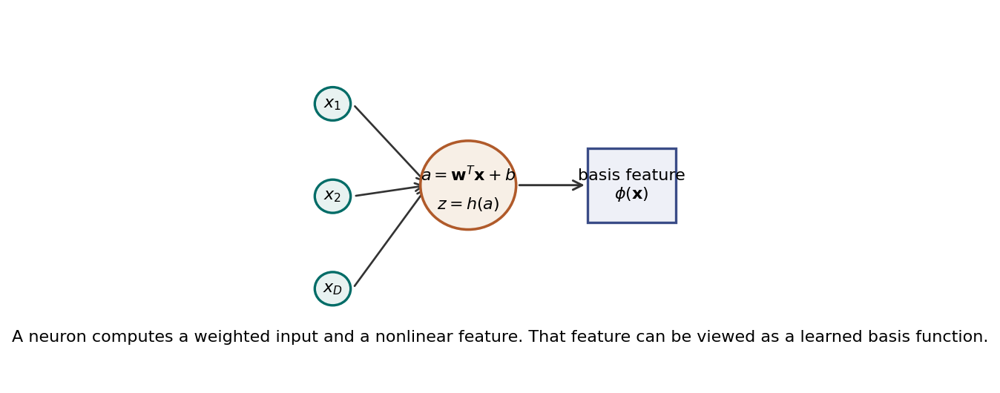
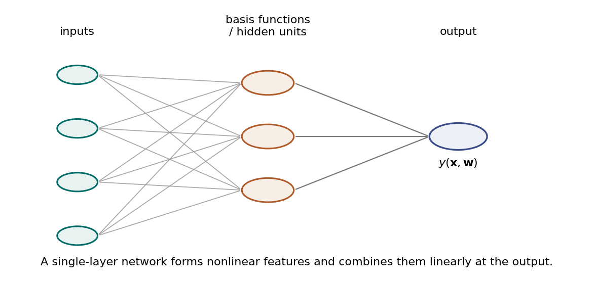
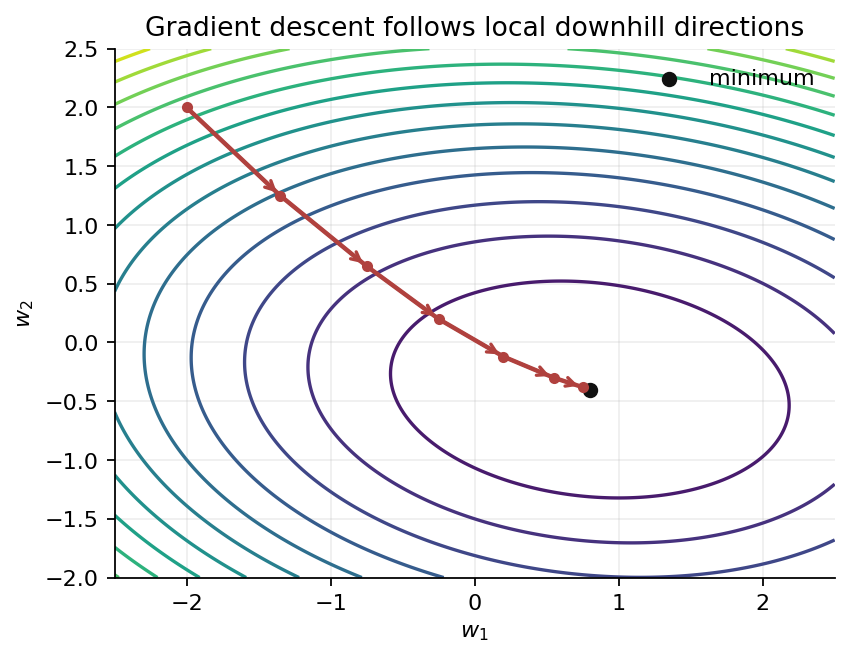
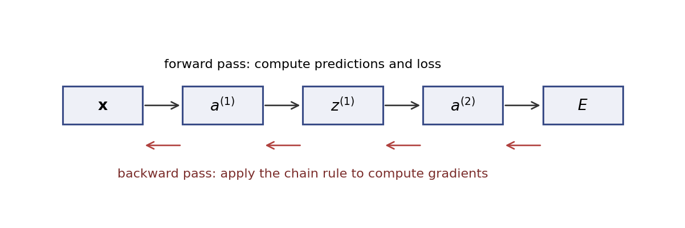

# Mini-Tutorial 2A - Intro to Neural Networks

Neural networks are flexible function approximators. They take an input vector, transform it through weighted sums and nonlinear functions, and produce an output used for prediction, classification, control, generation, or decision-making.

The key idea is simple:

$$
\text{input} \longrightarrow \text{features} \longrightarrow \text{output}.
$$

What makes neural networks powerful is that the features are learned from data rather than designed completely by hand.

## Neurons, Basis Functions, and Their Relationship

### What Is a Neuron?

A basic artificial neuron receives an input vector:

$$
\mathbf{x} =
\begin{bmatrix}
x_1 & x_2 & \cdots & x_D
\end{bmatrix}^\mathsf{T}.
$$

It computes a weighted sum:

$$
a = \mathbf{w}^\mathsf{T}\mathbf{x}+b,
$$

where $\mathbf{w}$ is a weight vector and $b$ is a bias. Then it passes this value through a nonlinear activation function $h$:

$$
z = h(a).
$$

The quantity $a$ is often called the **activation input** or **pre-activation**. The quantity $z$ is the neuron's output.

Common activation functions include:

| Activation | Formula | Typical role |
| --- | --- | --- |
| Linear | $h(a)=a$ | Regression outputs |
| Sigmoid | $h(a)=1/(1+e^{-a})$ | Probabilities, older hidden units |
| Tanh | $h(a)=\tanh(a)$ | Zero-centered nonlinear hidden units |
| ReLU | $h(a)=\max(0,a)$ | Common hidden-unit activation |

*Fig. 1. A neuron computes a weighted input and a nonlinear feature. That feature can be viewed as a learned basis function.*

### What Is a Basis Function?

A **basis function** is a function that transforms the original input into a feature:

$$
\phi_j(\mathbf{x}).
$$

A linear model using basis functions has the form:

$$
y(\mathbf{x},\mathbf{w}) =
w_0 + \sum_{j=1}^{M} w_j\phi_j(\mathbf{x}).
$$

This is linear in the parameters $w_j$, but it can be nonlinear in the input $\mathbf{x}$. For example:

$$
\phi_1(x)=x,
\qquad
\phi_2(x)=x^2,
\qquad
\phi_3(x)=\exp\left(-\frac{(x-c)^2}{2s^2}\right).
$$

The basis functions define the representation. The final weights define how those features are combined.

### Relationship Between Neurons and Basis Functions

A hidden neuron can be interpreted as a learned basis function:

$$
\phi_j(\mathbf{x}) = h(\mathbf{w}_j^\mathsf{T}\mathbf{x}+b_j).
$$

The important difference is that in classical basis-function models, the basis functions are often chosen before training. In neural networks, the parameters inside the basis functions, such as $\mathbf{w}_j$ and $b_j$, are learned from data.

So a neural network can be viewed as a basis-function model where the basis functions themselves adapt during training.

## Single-Layer Networks

A single-layer neural network builds several hidden features and combines them at the output:

$$
y_k(\mathbf{x},\mathbf{w}) =
f_k\left(
\sum_{j=1}^{M} w_{kj}^{(2)}
h\left((\mathbf{w}_j^{(1)})^\mathsf{T}\mathbf{x}+b_j^{(1)}\right)
+b_k^{(2)}
\right).
$$

Here:

- the first layer computes hidden features,
- the second set of weights combines those features,
- $f_k$ is the output activation.

*Fig. 2. A single-layer network forms nonlinear features and combines them linearly at the output.*

### Regression Example

Suppose a UAV uses sensor readings to predict remaining battery time:

$$
\mathbf{x} =
\begin{bmatrix}
\text{battery voltage}\\
\text{current draw}\\
\text{airspeed}\\
\text{wind estimate}
\end{bmatrix}.
$$

For regression, the output is a real number:

$$
y(\mathbf{x})\in\mathbb{R}.
$$

The network might be:

$$
y(\mathbf{x}) =
w_0 + \sum_{j=1}^{M} w_j h(\mathbf{w}_j^\mathsf{T}\mathbf{x}+b_j).
$$

The target value $t$ is the true remaining flight time. A common loss function is squared error:

$$
E(\mathbf{w}) =
\frac{1}{2}\sum_{n=1}^{N}
\left(y(\mathbf{x}_n,\mathbf{w})-t_n\right)^2.
$$

Training means adjusting the weights so that the predicted flight times are close to the observed flight times.

### Classification Example

For classification, suppose a UAV image patch must be classified as:

$$
\{\text{runway},\text{building},\text{tree},\text{road}\}.
$$

The network outputs one score per class:

$$
a_k(\mathbf{x}), \qquad k=1,\ldots,K.
$$

These scores can be converted to probabilities using the softmax function:

$$
p(C_k\mid\mathbf{x})
=
\frac{\exp(a_k)}
{\sum_{\ell=1}^{K}\exp(a_\ell)}.
$$

The predicted class is the one with the largest probability:

$$
\hat{k}=\arg\max_k p(C_k\mid\mathbf{x}).
$$

A common classification loss is cross-entropy:

$$
E(\mathbf{w}) =
-\sum_{n=1}^{N}
\sum_{k=1}^{K}
t_{nk}\log y_k(\mathbf{x}_n,\mathbf{w}),
$$

where $t_{nk}=1$ if example $n$ belongs to class $k$ and $0$ otherwise.

## Gradient Descent

Training a neural network means minimizing a loss function:

$$
E(\mathbf{w}).
$$

The vector $\mathbf{w}$ represents all trainable parameters in the network: weights and biases across all layers.

The gradient is:

$$
\nabla E(\mathbf{w})
=
\begin{bmatrix}
\frac{\partial E}{\partial w_1}\\
\frac{\partial E}{\partial w_2}\\
\vdots\\
\frac{\partial E}{\partial w_P}
\end{bmatrix}.
$$

It points in the direction of steepest local increase of the loss. Gradient descent moves in the opposite direction:

$$
\mathbf{w}^{(\tau+1)}
=
\mathbf{w}^{(\tau)}
-
\eta \nabla E(\mathbf{w}^{(\tau)}),
$$

where $\eta>0$ is the learning rate.

*Fig. 3. Gradient descent follows local downhill directions in parameter space.*

### What the Update Means

For one parameter $w_i$:

$$
w_i^{(\tau+1)}
=
w_i^{(\tau)}
-
\eta
\frac{\partial E}{\partial w_i}.
$$

If increasing $w_i$ increases the loss, then $\partial E/\partial w_i>0$, so gradient descent decreases $w_i$. If increasing $w_i$ decreases the loss, then $\partial E/\partial w_i<0$, so gradient descent increases $w_i$.

The learning rate controls step size:

- If $\eta$ is too small, training can be slow.
- If $\eta$ is too large, training can overshoot or diverge.
- If $\eta$ is reasonable, the loss often decreases steadily.

### Batch, Stochastic, and Mini-Batch Gradient Descent

If the loss is a sum over data points:

$$
E(\mathbf{w})=\sum_{n=1}^{N}E_n(\mathbf{w}),
$$

then the full gradient is:

$$
\nabla E(\mathbf{w})=
\sum_{n=1}^{N}\nabla E_n(\mathbf{w}).
$$

Computing this over all data points can be expensive. In practice, neural networks are usually trained with mini-batches:

$$
\nabla E_B(\mathbf{w})
=
\frac{1}{|B|}
\sum_{n\in B}
\nabla E_n(\mathbf{w}),
$$

where $B$ is a small subset of the data.

Mini-batch gradients are noisy estimates of the full gradient, but they are much cheaper to compute and often work well.

### A Taste of the Optimization Math

For simple convex problems, such as linear regression with squared error, the loss has one global minimum. In those cases, gradient descent can be analyzed cleanly: with a suitable learning rate, each step moves closer to the optimum.

Neural network losses are usually nonconvex. They can have flat regions, saddle points, and many different parameter settings that give similar predictions. A complete analysis requires tools from multivariable calculus, linear algebra, numerical optimization, and probability. We will not rebuild that theory here. The practical idea to keep is:

$$
\text{compute a gradient} \quad \rightarrow \quad
\text{take a small downhill step} \quad \rightarrow \quad
\text{repeat}.
$$

Modern training often improves plain gradient descent with momentum, adaptive learning rates, normalization, regularization, and careful initialization.

## Backpropagation

Backpropagation is an efficient way to compute gradients in a neural network. It is not a different learning rule from gradient descent. Instead, it supplies the gradients that gradient descent needs.

The core mathematical tool is the chain rule.

Suppose:

$$
E = E(y),
\qquad
y = f(a),
\qquad
a = wx+b.
$$

Then:

$$
\frac{\partial E}{\partial w}
=
\frac{\partial E}{\partial y}
\frac{\partial y}{\partial a}
\frac{\partial a}{\partial w}.
$$

Since:

$$
\frac{\partial a}{\partial w}=x,
$$

we get:

$$
\frac{\partial E}{\partial w}
=
\frac{\partial E}{\partial y}
f'(a)x.
$$

Backpropagation applies this idea repeatedly from the output layer back toward the input layer.

*Fig. 4. Backpropagation uses a forward pass to compute predictions and a backward pass to compute gradients with the chain rule.*

### Forward Pass

The network computes activations layer by layer:

$$
\mathbf{a}^{(\ell)}
=
\mathbf{W}^{(\ell)}
\mathbf{z}^{(\ell-1)}
+
\mathbf{b}^{(\ell)},
$$

$$
\mathbf{z}^{(\ell)}
=
h(\mathbf{a}^{(\ell)}).
$$

At the output, the network computes a prediction and a loss.

### Backward Pass

Define an error signal:

$$
\boldsymbol{\delta}^{(\ell)}
=
\frac{\partial E}{\partial \mathbf{a}^{(\ell)}}.
$$

For the output layer, this comes directly from the loss. For earlier layers, it is propagated backward:

$$
\boldsymbol{\delta}^{(\ell)}
=
\left((\mathbf{W}^{(\ell+1)})^\mathsf{T}
\boldsymbol{\delta}^{(\ell+1)}\right)
\odot
h'(\mathbf{a}^{(\ell)}),
$$

where $\odot$ means elementwise multiplication.

Once $\boldsymbol{\delta}^{(\ell)}$ is known, the gradients are:

$$
\frac{\partial E}{\partial \mathbf{W}^{(\ell)}}
=
\boldsymbol{\delta}^{(\ell)}
(\mathbf{z}^{(\ell-1)})^\mathsf{T},
$$

$$
\frac{\partial E}{\partial \mathbf{b}^{(\ell)}}
=
\boldsymbol{\delta}^{(\ell)}.
$$

The important point is efficiency. Backpropagation reuses intermediate quantities from the forward pass, so all gradients can be computed with cost comparable to a small number of forward passes.

## Specialized Neural Networks

The basic feedforward network is only one member of a large family. Different architectures build in assumptions about the data.

### Convolutional Neural Networks

**Convolutional neural networks** or **CNNs** are designed for grid-like data such as images. A convolutional layer applies small filters across an image:

$$
\text{local pattern} \rightarrow \text{feature map}.
$$

CNNs exploit two useful assumptions:

- nearby pixels are strongly related,
- the same visual pattern can appear in many image locations.

For UAVs, CNNs are common in runway detection, object detection, semantic segmentation, and terrain classification.

### Transformers

**Transformers** use attention mechanisms to decide which parts of an input are relevant to each other. Instead of processing a sequence strictly left-to-right, attention compares tokens or patches directly.

The basic attention operation has the form:

$$
\operatorname{Attention}(Q,K,V)
=
\operatorname{softmax}
\left(
\frac{QK^\mathsf{T}}{\sqrt{d_k}}
\right)V.
$$

Transformers are used in language models, vision transformers, multimodal models, and sequence prediction. In UAV settings, they can be used for mission-language understanding, trajectory forecasting, and multi-sensor sequence modeling.

### Graph Neural Networks

**Graph neural networks** or **GNNs** operate on data represented as nodes and edges. Each node updates its representation by aggregating information from neighboring nodes.

This is useful when the structure is not a grid or sequence. Examples include multi-UAV coordination graphs, communication networks, road networks, and airspace interaction graphs.

### Variational Autoencoders

**Variational autoencoders** or **VAEs** are probabilistic generative models. They learn a latent variable representation $\mathbf{z}$ and use it to generate or reconstruct data $\mathbf{x}$.

The encoder approximates:

$$
q(\mathbf{z}\mid\mathbf{x}),
$$

and the decoder models:

$$
p(\mathbf{x}\mid\mathbf{z}).
$$

VAEs are useful for representation learning, anomaly detection, and generating plausible data samples.

### Normalizing Flows

**Normalizing flows** are generative models based on invertible transformations. They start with a simple random variable $\mathbf{z}$ and transform it into a complex variable $\mathbf{x}$:

$$
\mathbf{x}=f(\mathbf{z}).
$$

Because $f$ is invertible, the density of $\mathbf{x}$ can be computed exactly using the change-of-variables formula:

$$
p(\mathbf{x})
=
p(\mathbf{z})
\left|
\det
\frac{\partial f^{-1}}{\partial \mathbf{x}}
\right|.
$$

Normalizing flows are useful when we want flexible probability distributions with exact likelihoods.

## Summary

A neuron computes a weighted sum followed by a nonlinear activation. Hidden neurons can be interpreted as learned basis functions. Single-layer networks combine these learned features for regression or classification. Training means minimizing a loss function, usually with mini-batch gradient descent. Backpropagation efficiently computes the gradients needed for training. Specialized architectures such as CNNs, transformers, GNNs, VAEs, and normalizing flows adapt the neural-network idea to images, sequences, graphs, and generative modeling.

## References

- Christopher M. Bishop, *Pattern Recognition and Machine Learning*, Springer, 2006. Book site: <https://www.microsoft.com/en-us/research/people/cmbishop/prml-book/>
- Christopher M. Bishop and Hugh Bishop, *Deep Learning: Foundations and Concepts*, Springer, 2023. Book site: <https://www.bishopbook.com/>
- Ian Goodfellow, Yoshua Bengio, and Aaron Courville, *Deep Learning*, MIT Press, 2016. Book site: <https://www.deeplearningbook.org/>
