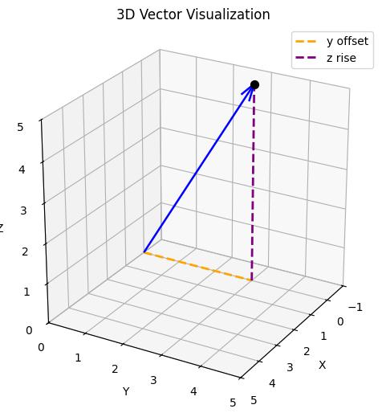
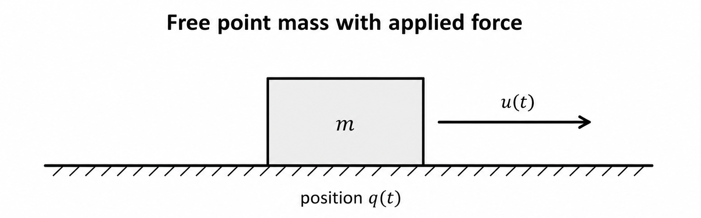
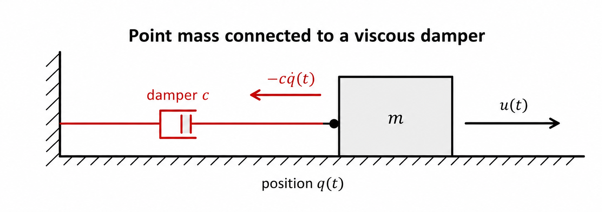
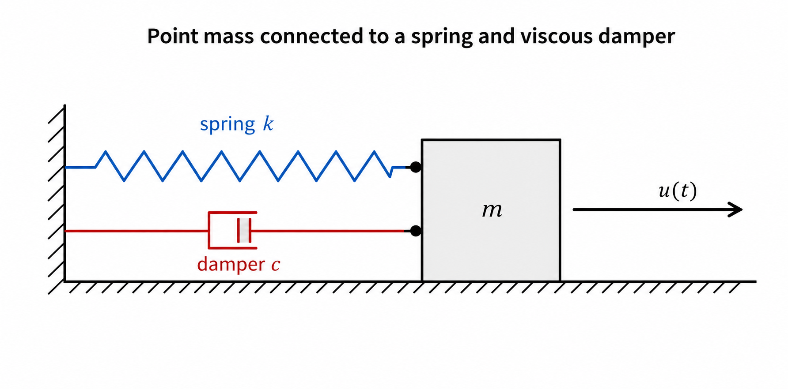

<!-- Mini-Tutorial 1 — Newton's Laws and Point-Mass Models

Question: How do physical systems move?

Topics:

Why mathematical models?
Scalars and vectors (brief)
Position, velocity, acceleration
Newton's three laws
Point-mass assumption
Free-body diagrams
Free mass
Mass–damper
Mass–spring–damper
Deriving equations of motion

Notebook:

Simulate the three systems.
Vary m, c, and k. -->

# From Newton's Laws to Equations of Motion

This tutorial provides foundational concepts from classical mechanics that are useful for studying autonomous systems, including motion planning, control, system identification, physics-informed machine learning, and digital twins. For students entering these fields from different backgrounds, a refresher on the basic principles of mechanics can be helpful for understanding how the motion of physical systems, such as drones, aircraft, robots, or other bodies, can be modeled mathematically.

We will not cover aerodynamics or detailed rigid-body dynamics here. Instead, we start with the fundamental concepts of motion, forces, and Newton's laws and use them to derive simple equations of motion under the point-mass approximation.

> How do we mathematically describe the motion of physical systems?
> How can Newton's laws of motion be used to derive equations of motion under a simplified point-mass assumption?

By end of this tutorial you should be able to:

1. Recall Newton's three laws of motion.
2. Distinguish between kinematics, kinetics, and dynamics.
3. Explain the point-mass approximation and its limitations.
4. Derive equations of motion for a free mass, a forced mass, a mass–damper system, and a mass–spring–damper system.
5. Explore through numerical simulation how physical parameters such as mass, damping, and spring stiffness affect the motion of a system (optional).

## Mathematical preliminaries: scalars and vectors

In order to understand equations of motion, it is important that you can distinguish between scalars and vectors, and how we represent them. Vectors are essential in Newtonian mechanics for deriving equations of motion. The key mathematical distinction is:

$$
\text{scalar} \in \mathbb{R} \quad \text{versus} \quad \text{vector} \in \mathbb{R}^n
$$

### 1. Scalars
A scalar is a single numerical value. Formally, a real-valued physical quantity s, is expressed as

$$ s \in \mathbb{R}$$

For example, the mass of an object is a scalar:

$$m \in \mathbb{R}_{>0}$$

If $m = 2 \text{ kg}$, then $m$ specifies a magnitude but has no spatial direction.

Other scalar quantities include time, temperature, speed, distance, and energy:

$$t \in \mathbb{R}_{\ge0}, \quad T \in \mathbb{R}, \quad v_{\text{speed}} \in \mathbb{R}_{\ge0}$$

Strictly speaking, physical quantities carry units, so $m = 2 \text{ kg}$ is not literally just the real number $2$. In an introductory treatment, however, it is standard to represent the numerical value of a scalar physical quantity as an element of $\mathbb{R}$, with its unit stated separately.

### 2. Vectors
A vector is an element of a vector space. For the elementary mechanics considered here, vectors are commonly represented as elements of the real vector space $\mathbb{R}^n$. When $\mathbb{R}^n$ is equipped with the standard inner product and its associated norm, it is the familiar n-dimensional Euclidean space.

$$\mathbf{v} \in \mathbb{R}^n$$

For three-dimensional motion:

$$\mathbf{v} \in \mathbb{R}^3$$

It can be represented in Cartesian coordinates as:

$$\mathbf{v} = \begin{bmatrix} v_x \\ v_y \\ v_z \end{bmatrix}$$

Each component is itself a scalar:

$$v_x, v_y, v_z \in \mathbb{R}$$

A vector has both a magnitude and a direction. Its Euclidean magnitude is:

$$\|\mathbf{v}\|_2 = \sqrt{v_x^2 + v_y^2 + v_z^2}$$

> Important: The Euclidean norm $\|\mathbf{v}\|_2$ is a **scalar** rather than a vector and describes the length, or magnitude, of the vector.

For example, below you see the following vector:

```python
import numpy as np
import matplotlib.pyplot as plt

startpoint = np.array([0.0, 0.0, 0.0])
endpoint = np.array([0.0, 3.0, 5.0])
v = endpoint - startpoint
```
When you plot it with matplotlib, you can see what the vector looks like.

In order to distinguish vectors from scalars, we can adopt different notations. We use **bold**, lowercase notation like "$\mathbf{v}$" rather than "$\vec{v}$" when referring to vectors, and we use plain $v$ for a scalar.



So keep in mind that some physical quantities are vectors, and thus have both direction and magnitude.

## Kinematics

Kinematics describes the motion of an object without considering the forces and moments that cause that motion. It describes quantities such as position, velocity, and acceleration.

Kinematics is one part of dynamics, the branch of mechanics concerned with bodies in motion. Dynamics is commonly divided into:

> Kinematics: How does the object move?
> Kinetics: What forces and moments cause or change that motion?

We first introduce three fundamental kinematic quantities—position, velocity, and acceleration—before turning to Newton's laws to relate forces to motion.

### 1. Position

Formally, a **position** is a point in Euclidean space, whereas **displacement** is a vector. We denote the world-fixed reference frame by $\mathcal{W}$. Once we choose an origin and a coordinate frame, we represent the position of a point $P$ by its position vector:

$$\mathbf{p}^W = \begin{bmatrix} p_x \\ p_y \\ p_z \end{bmatrix} \in \mathbb{R}^3$$

The superscript $W$ indicates that its coordinates are expressed relative to the world frame $W$. We will turn to other frames, such as body frame or wind frame, in a following tutorial. For now, we use the superscript $\mathcal{W}$ to refer to the world reference frame. All vectors appearing in a vector force balance must be expressed in the same coordinate frame.

Given two positions, $\mathbf{p}_1^W, \mathbf{p}_2^W \in \mathbb{R}^3$, their displacement is:

$$\Delta\mathbf{p}^W = \mathbf{p}_2^W - \mathbf{p}_1^W$$

### 2. Velocity
Velocity is the time rate of change of position. It represents both the speed and the instantaneous direction of motion. Formally, it is the first time derivative of the position vector:

$$\mathbf{v}^W = \frac{d\mathbf{p}^W}{dt} = \begin{bmatrix} \dot{p}_x \\ \dot{p}_y \\ \dot{p}_z \end{bmatrix} = \begin{bmatrix} v_x \\ v_y \\ v_z \end{bmatrix} \in \mathbb{R}^3$$

The overdot ($\dot{p}$) is standard notation representing a derivative with respect to time ($t$).

### 3. Acceleration
Acceleration is the time rate of change of velocity, describing how quickly an object's speed or direction changes. It is the first time derivative of velocity and the second time derivative of position:

$$\mathbf{a}^W = \frac{d\mathbf{v}^W}{dt} = \frac{d^2\mathbf{p}^W}{dt^2} = \begin{bmatrix} \dot{v}_x \\ \dot{v}_y \\ \dot{v}_z \end{bmatrix} = \begin{bmatrix} \ddot{p}_x \\ \ddot{p}_y \\ \ddot{p}_z \end{bmatrix} = \begin{bmatrix} a_x \\ a_y \\ a_z \end{bmatrix} \in \mathbb{R}^3$$


## Newton's Three Laws

### Newton's First Law
A body remains at rest or moves at a constant velocity unless acted on by a nonzero net external force. Mathematically, this implies that when the vector sum of forces is zero, the acceleration vector is also zero:

$$\sum_{i} \mathbf{F}_i = \mathbf{0} \implies \mathbf{a} = \mathbf{0}$$

### Newton's Second Law
The net external force equals the rate of change of linear momentum:

$$\sum_{i} \mathbf{F}_i = \frac{d}{dt}(m\mathbf{v})$$

For a fixed mass ($m$), this simplifies to Newton's second law:

$$\sum_{i} \mathbf{F}_i = m\mathbf{a}$$

Here, $m \in \mathbb{R}_{>0}$ represents the mass, while $\mathbf{F}_i \in \mathbb{R}^3$ and $\mathbf{a} \in \mathbb{R}^3$ represent the force and acceleration vectors. Multiplying the vector $\mathbf{a}$ by the scalar $m$ yields:

$$m\mathbf{a} = m \begin{bmatrix} a_x \\ a_y \\ a_z \end{bmatrix} = \begin{bmatrix} ma_x \\ ma_y \\ ma_z \end{bmatrix}$$

This element-wise scaling highlights why Newton's second law is fundamentally a vector equation. Consequently, it serves as the foundational principle for deriving equations of motion in classical mechanics.

### Newton's Third Law
When body $A$ exerts a force on body $B$, body $B$ exerts an equal and opposite force on body $A$. If $\mathbf{F}_{B \to A}$ represents the force exerted on body $B$ by body $A$, and $\mathbf{F}_{A \to B}$ represents the force exerted on body $A$ by body $B$, then:

$$\mathbf{F}_{B \to A} = -\mathbf{F}_{A \to B}$$

This balance ensures that internal forces within a closed system cancel out, conserving total linear momentum.

## Deriving Equations of Motion for Point-Mass Systems

In Newtonian mechanics, quantities such as position, velocity, acceleration, and force are represented using scalars and vectors. Newton's second law provides the fundamental relationship between the net external force acting on a body and the resulting acceleration. This relationship will now allow us to derive equations of motion for increasingly complex point-mass systems. Before we do this, let's look at important force vectors.

## Force Vectors Used in This Tutorial

There are a couple of forces that are essential for studying autonomous systems.

### 1. Gravity ($\mathbf{F}_g$)
Gravity is a constant field force acting downward along the negative vertical axis (typically the $z$-axis in aviation coordinate systems; we will return to this in another tutorial). Assuming a world frame $W$ whose $z$-axis points upward, the equation is:

$$
\mathbf{F}_g^W = \begin{bmatrix} 0 \\ 0 \\ -mg \end{bmatrix} \in \mathbb{R}^3
$$

with
*   **$m \in \mathbb{R}_{>0}$:** The scalar mass of the vehicle ($\text{kg}$).
*   **$g \approx 9.81\text{ m/s}^2$:** The acceleration due to gravity.


### 2. Viscous Damping ($\mathbf{F}_d$)
A viscous damper is an idealized dissipative mechanical element that produces a force proportional to the relative velocity across the damper and opposite to that relative motion. For a damper connected to a fixed reference, a simple linear model is

$$
\mathbf{F}_d^W = -c \mathbf{v}^W = -c \begin{bmatrix} v_x \\ v_y \\ v_z \end{bmatrix} \in \mathbb{R}^3
$$

*   **$c \in \mathbb{R}_{>0}$:** The damping coefficient ($\text{N}\cdot\text{s/m}$).
*   **$\mathbf{v}^W$:** The velocity vector. The negative sign ensures the force is always purely dissipative, directly opposing the direction of travel.

This linear damping model is useful for illustrating dissipative forces. It should not generally be confused with aerodynamic drag, which often depends nonlinearly on relative airspeed. We will turn to this in a later tutorial.

### 3. Restoring Spring Force ($\mathbf{F}_s$)
A **spring** is an elastic mechanical element that produces a restoring force when it is stretched or compressed away from its equilibrium configuration. For an ideal linear spring, the restoring force is described by **Hooke's law**. We will introduce Hooke's law formally when we derive the one-dimensional mass–spring–damper system below.

### 4. Externally Applied Force for Control ($\mathbf{F}_u$)
In autonomous aviation and robotics, we often deal with forces related to the concept of **control**. A control input changes the system's behavior through an externally applied force. For example, when we drive a car, the throttle changes the force at the wheels and therefore affects the car's speed. In many cases, control forces are designed to stabilize the system. We will return to these ideas later in a more detailed discussion of control theory and control algorithms. For now, we only need the concept of an external input force:

$$
\mathbf{F}_u(t) = \mathbf{u}(t)
$$

This is typically a force vector in $\mathbb{R}^3$ that varies over time.


> With these example forces in mind, let's now focus on a point mass and derive equations of motion.

## Point mass assumptions
In many areas of research for autonomous aviation (such as high-level trajectory generation and global motion-planning), it is often sufficient to represent a complex vehicle like a quadrotor or fixed-wing aircraft as a simplified **point-mass** (or particle) to derive its translational equations of motion.

For a point-mass model, the following core assumptions hold:

### 1. Concentrated Mass at a Single Point
The point mass is a model representation of a body where physical properties such as volume and geometry are neglected. The entire finite mass of the body is assumed to be concentrated at a single, infinitely small spatial point corresponding to the body's center of mass (CoM). This is only an approximation, since no real body is actually a point mass.

### 2. Neglected Rotational Dynamics
Because a mathematical point has no spatial distribution, it possesses no rotational inertia. Consequently, the vehicle's orientation and angular velocity are completely omitted. The body is treated as having **three translational degrees of freedom (3-DoF)** rather than the full six degrees of freedom (6-DoF) of a true rigid body.

The translational motion can therefore be described by the body's position $\mathbf{p}(t) \in \mathbb{R}^3$ and velocity $\mathbf{v}(t) \in \mathbb{R}^3$.

In a future tutorial, you will learn how these two states can be combined in a single state vector.

### 3. Coincident Forces
In a point-mass model, rotational effects are neglected. External forces are therefore represented by their resultant force acting through the modeled point, and moments or torques are not modeled explicitly. Because the forces have no moment arm relative to the Center of Mass, they produce zero torque ($\boldsymbol{\tau} = \mathbf{0}$).

$$\boldsymbol{\tau} = \mathbf{r} \times \mathbf{F} = \mathbf{0} \times \mathbf{F} = \mathbf{0}$$

Such a simplified model has limitations. For example, it ignores how rigid-body geometry affects forces and moments. It also ignores how the shape of an aircraft's wings creates aerodynamic forces through fluid flow.


After revisiting Newton's laws, point-mass assumptions, and key force vectors, let's derive equations of motion for simple point-mass systems.

### Example: Equations of Motion of a Free Mass in Three Dimensions

When a point-mass moves in a vacuum with no external forces acting on it, Newton's first law holds. Inertia defines the motion.

$$
\sum \mathbf{F} = 0 \implies m\,\mathbf{a} = 0
$$

Since mass cannot be zero, the magnitude of the acceleration vector must be zero.

We find the velocity vector by integrating the zero acceleration vector over time:

$$
\begin{aligned}
\frac{d}{dt} \mathbf{v}(t) &= \mathbf{0}, \\
\mathbf{v}(t) &= \mathbf{v}_0 = \begin{bmatrix} v_{0x} \\ v_{0y} \\ v_{0z} \end{bmatrix}
\end{aligned}
$$

The velocity vector remains completely constant over time. The mass experiences no change in its speed or its direction of motion.

We find the position vector by substituting the constant velocity vector into the position derivative equation and integrating:

$$
\frac{d}{dt} \mathbf{p}(t) = \mathbf{v}_0
$$
$$
\int_{0}^{t} \frac{d}{d\tau} \mathbf{p}(\tau) \, d\tau = \int_{0}^{t} \mathbf{v}_0 \, d\tau
$$

Because $\mathbf{v}_0$ is a constant vector, it pulls out of the integral operator:

$$
\mathbf{p}(t) - \mathbf{p}_0 = \mathbf{v}_0 \int_{0}^{t} d\tau
$$

$$
\mathbf{p}(t) = \mathbf{p}_0 + \mathbf{v}_0 t
$$

## Equations of Motion for Forced Motion Restricted to One Dimension

To introduce applied forces, damping, and spring forces without unnecessary geometric complexity, we now restrict the point mass to motion along a single axis.
We denote its scalar position along this axis by

$q(t) \in \mathbb{R}$ and

its velocity and its acceleration are therefore

$\dot q(t) \in \mathbb{R} \quad \text{and} \quad \ddot q(t)\in \mathbb{R}$

respectively. Thus, the following sections will drop vector notation.

This one-dimensional modeling sets the foundations for more advanced 3-D modeling.


### 1. Forced Free Mass
Next, we can imagine a mass being forced with a force $\mathbf{u}$ defined as

$$
F_u(t) = u(t)
$$

Then, Newton's second law gives

$$
m \ddot{q}(t)=u(t).
$$

Therefore,

$$
\boxed{\ddot q(t)=\frac{1}{m}u(t).}
$$



### 2. Forced Mass-Damper

A viscous damper produces a force proportional to relative velocity and opposite to motion.

Using the definition of a damping force above, and focusing on horizontal motion only, this leads to

$$
F_d(t) = -c\dot{q}(t)
$$


where $c > 0$ is the damping coefficient.

Thus, based on Newton's second law the horizontal force balance is

$$
u(t)-c\dot{q}(t)=m\ddot{q}(t).
$$

Rearranging this leads to

```{math}
\boxed{m\ddot q(t)+c\dot q(t)=u(t)}
```

or

```{math}
\boxed{\ddot q(t)=-\frac{c}{m}\dot q(t)+\frac{1}{m}u(t)}
```



> Interpretation: The damper resists velocity, not position. If the applied force is removed, the mass slows down and eventually stops, but it is not pulled back to its starting point.

### 3. Forced Mass-Spring-Damper


We now add a linear spring to the mass-damper. Before deriving the resulting equation of motion, we first introduce Hooke's law, which describes the force generated by an ideal linear spring.

Consider a spring attached to a fixed wall at one end and to the point mass at the other. The spring has an equilibrium position, at which it is neither stretched nor compressed. We choose this equilibrium position as

$$
q(0) = 0.
$$

If the mass is displaced from equilibrium, the spring produces a force that acts in the direction opposite to the displacement. This relationship is described by Hooke's law:

$$
F_s(t)=-kq(t),
$$

where
* $F_s(t)$ is the spring force in newtons (N),
* $k>0$ is the spring stiffness is the spring stiffness in (N/m),
* and $q(t)$ is the displacement of the mass from the spring's equilibrium position in meters (m).

The negative sign is important. It indicates that the spring force acts in the direction opposite to the displacement. The spring therefore attempts to restore the mass to its equilibrium position.

If $q(t) > 0$, then $F_s(t) < 0$ and the spring is pulling the body backwards towards the equilibrium position $q(0) = 0$.

However, if $q(t) < 0$, then $F_s(t) > 0$ and the spring pushes the body towards the equilibrium position $q(0) = 0$.

What is important is that in both cases, the spring pushes the body towards the equilibrium.
What is important is that $q(t)$ is not the absolute position but the position relative to the equilibrium $q(0) = 0$. If the absolute coordinate were $x(t)$, and the spring equilibrium were $x_{\mathrm{eq}}$, then Hooke's law becomes

$$
F_s(t) = -k [x(t) - x_{\mathrm{eq}}],
$$


There are three forces that help us derive the equations of motion: damping, the spring force, and the externally applied force:

$$
F_u=u(t),\qquad
F_d=-c\dot q(t),\qquad
F_s=-kq(t).
$$

Applying Newton's second law,

$$
u(t)-c\dot q(t)-kq(t)=m\ddot q(t).
$$

Thus,
$$
\boxed{m\ddot q(t)+c\dot q(t)+kq(t)=u(t).}
$$

or rearranging gives us:

$$
\boxed{
\ddot q(t)
=
-\frac{k}{m}q(t)
-\frac{c}{m}\dot q(t)
+\frac{1}{m}u(t).
}
$$



Summary of the key terms and physical meaning

| Term | Physical meaning |
|---|---|
| $m\, \ddot q(t)$ | inertial response |
| $c\,\dot q(t)$ | damping; opposes velocity |
| $k\,q(t)$ | restoring effect; opposes displacement |
| $u\,(t)$ | externally applied force |

## Connection to autonomous systems

A simplified vehicle model also begins with

$$
m\ddot{\mathbf{p}}^W(t)=\mathbf{F}^W_{\mathrm{net}}(t).
$$

The important modeling questions are:

- Which forces matter for the task?
- Which effects can be neglected?
- Is a point-mass model sufficient?
- Is motion one-dimensional, planar, or three-dimensional?
- Is orientation required?

These decisions determine the equation of motion and the fidelity of the resulting simulator.

## Exercises

### 1. Exercise

Write a script that simulates the behavior of the four systems above, and plot the results. Start with the forced mass and the mass-damper, assuming one-dimensional motion, and vary the coefficients $c$ and $m$ and the external force $u$. Then add the mass-spring-damper and vary $c$, $k$, $m$, and $u$. What do you learn?

### 2. Exercise
Extend the forced mass and the forced mass-damper motion to the 2-D case. Start by deriving the equations of motion using vector notation.


## Quiz

### 1. Question 1

What information is neglected when a rigid object is modeled as a point mass?

### 2. Question 2

Why is the damping force written as this?

$$
F_d = -c\dot q
$$

### 3. Question 3

A mass–damper system is released with nonzero velocity and no applied force. As $t\to\infty$, its velocity approaches zero. Does its position necessarily return to its initial position? Explain!


### 4. Question 4

Starting from the force balance

$$
u -c\dot q -kq=m \ddot q
$$

Rewrite as an unforced mass-spring-damper with $u=0$.


## References

Åström, K. J., and Murray, R. M. (2008). *Feedback Systems: An Introduction for Scientists and Engineers*. Princeton University Press.
Roth, S., and Stahl, A. 2025. *Kinematics of the Point Mass,* in Mechanics: Experimental Physics - Descriptively Explained, S. Roth and A. Stahl (eds.), Berlin, Heidelberg: Springer, pp. 47–79. (https://doi.org/10.1007/978-3-662-68079-7_5).
